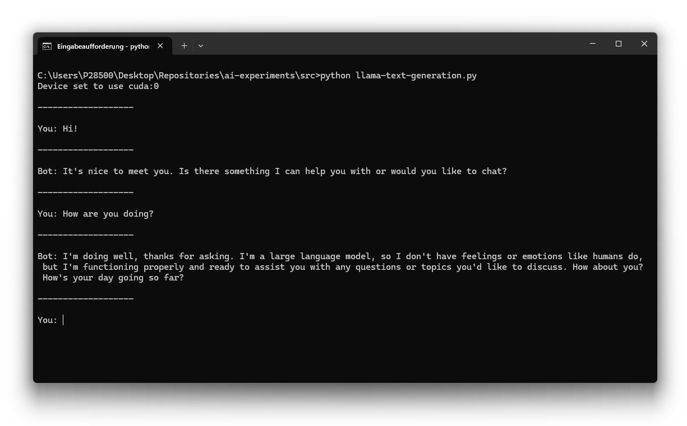
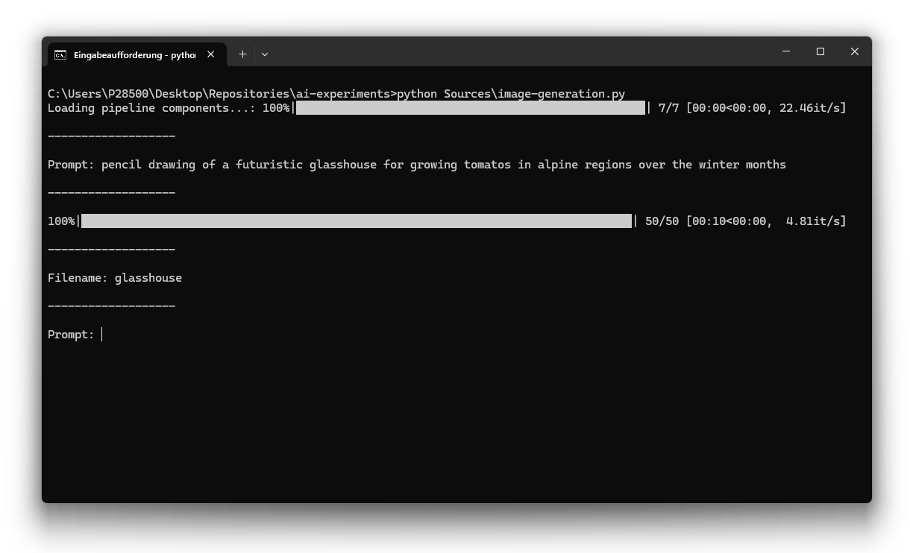

# AI Experiments

This repository contains my personal experiments with artificial intelligence libraries and tools.
In the following, you find some example applications, which I have developed during my AI learning journey.
It is amazing to see, how easy AI can be integrated into software applications nowadays.

## Examples

Here is an overview of the examples contained in this repository.

### 🧑‍💻 [Text Generation](./Sources/text-generation.py)

This first example demonstrates the use of LLaMa 3.2 for providing a ChatGPT-like experience on your local computer in the command line.



### 🧑‍💻 [Image Generation](./Sources/image-generation.py)

This second example demonstrates the use of Stable Diffusion 1.5 for generating images from text prompts on your local computer in the command line.



The above prompt generated the following image.
Note that with other pretrained diffusion models and prompts better results probably can be achieved.


### 🧑‍💻 *More*

*... coming soon*

## Prerequisites

Here is a list of prerequisites, which are required for running the examples.

### 🧩 Python

Interpreter for the Python programming language.

*See https://www.python.org/*

### 🧩 PyTorch

GPU-based tensor computation library for the Python programming language.

*See https://github.com/pytorch/pytorch*

```
# ... with CUDA 11.8 (NVIDIA)
pip install torch torchvision torchaudio --index-url https://download.pytorch.org/whl/cu118

# ... with CUDA 12.1 (NVIDIA)
pip install torch torchvision torchaudio --index-url https://download.pytorch.org/whl/cu121

# ... with CUDA 12.4 (NVIDIA)
pip install torch torchvision torchaudio --index-url https://download.pytorch.org/whl/cu124

# ... with ROCm 6.2 (AMD)
pip install torch torchvision torchaudio --index-url https://download.pytorch.org/whl/rocm6.2
```

### 🧩 Transformers

Downloading and using pre-trained transformer models for generating text.

*See https://github.com/huggingface/transformers*

```
pip install transformers
```

### 🧩 Diffusers

Downloading and using pre-trained diffusion models for generating image, video, and audio.

```
pip install diffusers[torch]
```

*See https://github.com/huggingface/diffusers*

### 🧩 Accelerate

Multi-GPU training on top of PyTorch.

*See https://github.com/huggingface/accelerate*

```
pip install accelerate
```

### 🧩 Protobuf

Language-neutral and platform-independent serialization and deserialization of data structures.

*See https://github.com/protocolbuffers/protobuf*

```
pip install protobuf
```

### 🧩 SentencePiece

Unsupervised text tokenizer and detokenizer for neural network based text generation.

*See https://github.com/google/sentencepiece*

```
pip install sentencepiece
```