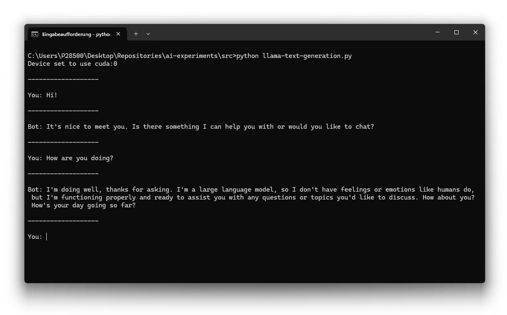

# AI Experiments

This repository contains my personal experiments with artificial intelligence libraries and tools.
In the following, you find some example applications, which I have developed during my AI learning journey.
It is amazing to see, how easy AI can be integrated into software applications nowadays.

## Examples

Here is an overview of the examples contained in this repository.

### 🧑‍💻 [LLaMa Text Generation](./Sources/llama-text-generation.py)

This first example demonstrates the use of LLaMa for providing a ChatGPT-like experience on your local computer in the command line.



### 🧑‍💻 *More*

*... coming soon*

## Prerequisites

Here is a list of prerequisites, which are required for running the examples.

### 🧩 Python

Interpreter for the Python programming language.

*See https://www.python.org/*

### 🧩 PyTorch

GPU-based tensor computation library for the Python programming language.

*See https://github.com/pytorch/pytorch*

```
# ... with CUDA 11.8 (NVIDIA)
pip install torch torchvision torchaudio --index-url https://download.pytorch.org/whl/cu118

# ... with CUDA 12.1 (NVIDIA)
pip install torch torchvision torchaudio --index-url https://download.pytorch.org/whl/cu121

# ... with CUDA 12.4 (NVIDIA)
pip install torch torchvision torchaudio --index-url https://download.pytorch.org/whl/cu124

# ... with ROCm 6.2 (AMD)
pip install torch torchvision torchaudio --index-url https://download.pytorch.org/whl/rocm6.2
```

### 🧩 Transformers

Downloading and using pre-trained transformer models for text, video, and audio.

*See https://github.com/huggingface/transformers*

```
pip install transformers
```

### 🧩 Accelerate

Multi-GPU training on top of PyTorch.

*See https://github.com/huggingface/accelerate*

```
pip install accelerate
```